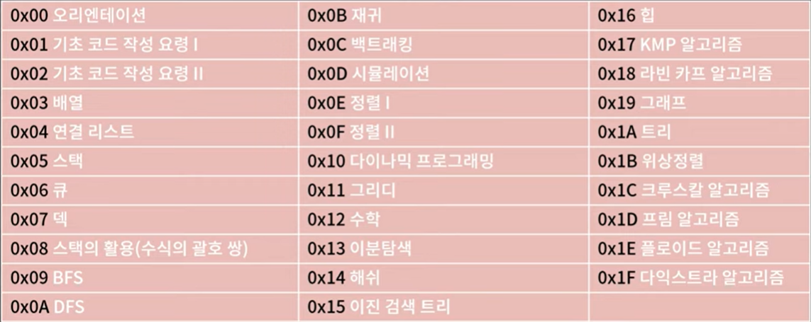
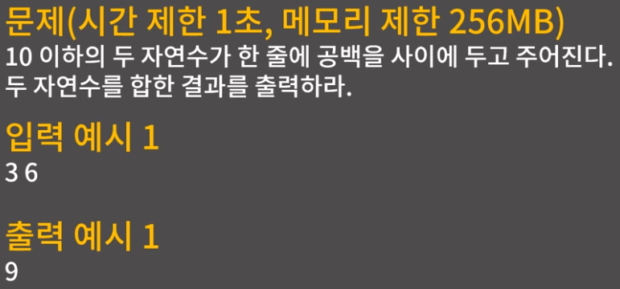
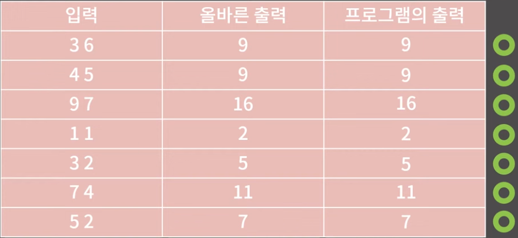

# 강의 구성

  

- 0x11강 까지는 필수로 무조건 해야함!
- BFS/DFS/백트래킹/시뮬레이션 문제가 많이 나

# 코딩테스트란?

- 주어진 문제를 정해진 시간/메모리 제한 내로 풀어내는 시험

## 코딩테스트 예시

  

- 시간 제한 : 프로그램이 시작하고 결과를 1초 안에 내고 정상적으로 종료되어야 한다.
- 메모리 제한 : 이 프로그램이 메모리를 256MB 이하로 사용해야 한다.
- 답안 예시
    
    ```cpp
    #include <iostream>
    
    using namespace std;
    
    int main(void){
    
    	int a, b;
    	
    	cin >> a >> b;
    	cout << a + b;
    	
    	return 0;
    }
    ```
    
- 답안 제출 → 서버는 **수 많은 테스트케이스(Test Case== TC)를 이용**하여 코드를 채점함
    
      
    
- 부분 점수같은건 없음. TC 중에 하나라도 불만족하면 그냥  틀린 것임

## 코딩테스트 대비를 위한 사이트

- 백준 온라인 저지 : https://acmicpc.net
- 프로그래머스 : https://programmers.co.kr
- 구름 : https://groom.io
- SW Expert Academy : https://swexpertacademy.com
    - 삼성이 관리하는 삼성 SW 역량 테스트가 출제되는 곳임으로 삼성을 노린다면 한 번쯤 들려보는 것이 좋음

<aside>
💡

제출이 됐다 하더라도 정답을 맞춘게 아닐 수 있으니 스스로 TC를 만들어서 체크해보는게 좋음

</aside>

## 코딩테스트 준비를 위해 필요한 것

### 배경지식

- 다양한 알고리즘, 자료구조, 기타 테크닉 등
- 문제를 해결하기 위해 필요한 지식

### 문제해결능력

- 배경지식을 지금 당면한 문제에 맞게 잘 변형해서 적용시키는 능력
- **“이 문제에서 요구하는 알고리즘이 무엇인가?”**를 알아차릴 수 있어야 함

### 구현력

- 본인이 생각한 풀이를 코드로 잘 옮겨낼 수 있는 능력
- 내가 맞은 문제를 다른 사람들은 어떻게 풀어냈는지 비교해보는걸 추

# 예시

## 문제 : 주어진 4칸짜리 배열에서 최댓값을 반환해라

- 첫 번째 풀이
    
    ```cpp
    int solution1(int arr[]){
    	if(arr[0] > arr[1] && arr[0] > arr[2] && arr[0] > arr[3])
    		return arr[0];
    	if(arr[1] > arr[0] && arr[1] > arr[2] && arr[1] > arr[3])
    		return arr[1];
    	if(arr[2] > arr[0] && arr[2] > arr[1] && arr[2] > arr[3])
    		return arr[2];
    	return arr[3];
    }
    ```
    
    - 그런데 만약에 최댓값이 여러개라면? → [9, 9, 3, 1]과 같은 배열이 주어진 경우
    → 두 번째 풀이
- 두 번째 풀이
    
    ```cpp
    int solution1(int arr[]){
    	if(arr[0] >= arr[1] && arr[0] >= arr[2] && arr[0] >= arr[3])
    		return arr[0];
    	if(arr[1] >= arr[0] && arr[1] >= arr[2] && arr[1] >= arr[3])
    		return arr[1];
    	if(arr[2] >= arr[0] && arr[2] >= arr[1] && arr[2] >= arr[3])
    		return arr[2];
    	return arr[3];
    }
    ```
    
    - 그런데, 두 번째 풀이도 노가다성이 있음
    → 세 번째 풀이
- 세 번째 풀이
    
    ```cpp
    int solution2(int arr[]){
    	int mx = arr[0];
    	for(int i = 0; i <= 3; i++){
    		if(arr[i] > mx) mx = arr[i];
    	}
    	return mx;
    }
    ```
    
- 네 번째 풀이 : STL을 이용해서 날로먹기
    
    ```cpp
    int solution3(int arr[]){
    	return *max_element(arr, arr+4);
    }
    ```
    
    - `max_element`
        - 가장 큰 원소가 있는 곳의 포인터(주소값)을 반환하는 함수
        - `*` operator를 이용해서 그 주소의 값을 반환하도록 함

## 어떤 풀이가 제일 좋은가?

- 누가 봐도 네 번째 풀이가 제일 깔끔해보임
- 즉, 다른 사람이 어떻게 풀었는지 확인해보면 더 멋진 코드를 만드는 법을 익힐 수도 있음

# 강의 연습문제 위치
https://github.com/encrypted-def/basic-algo-lecture/blob/master/workbook.md