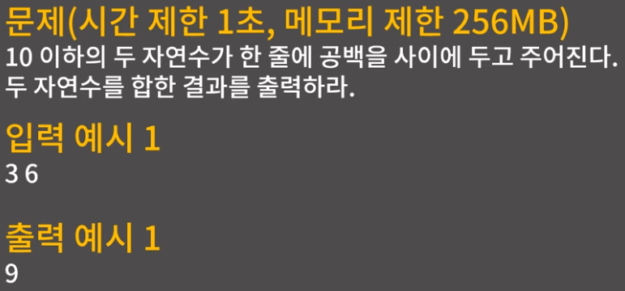
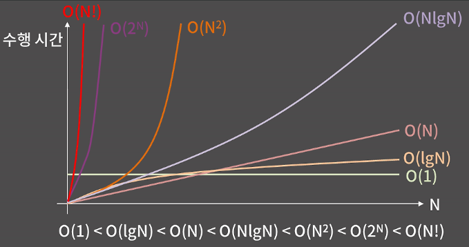
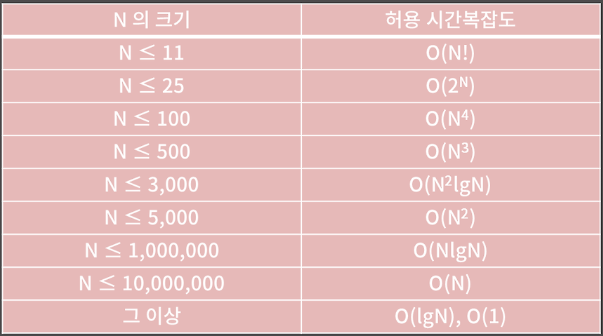
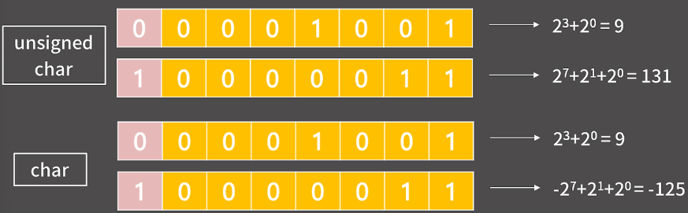
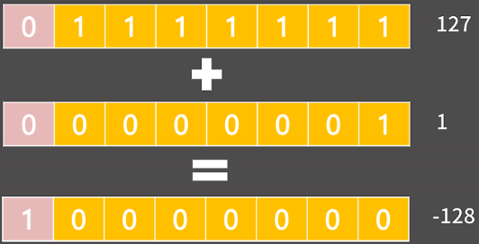
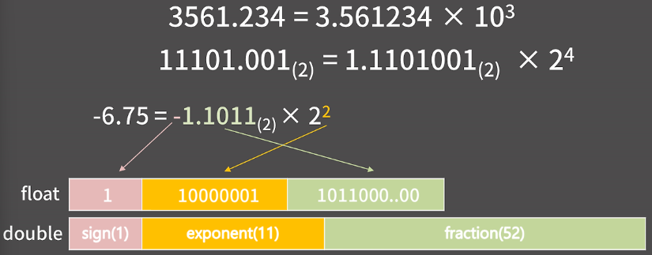

# 0x01. 기초 코드 작성 요령 I

# 0x00 시간, 공간 복잡도

## 시간 복잡도

### 예시 1 : 시간 제한 1초

[문제]



[답안]

```cpp
#include <iostream>

using namespace std;

int main(){

    int a, b;
    cin >> a >> b;
    cout << a + b;
    
    return 0;
}
```

- 컴퓨터는 1초에 대략 3~5억개 정도의 연산을 처리할 수 있음
    - 연산이 단순한 연산인지, 복잡한 연산인지에 따라 횟수에 대한 차이는 있을 수 있음
        - 단순 연산 : 비트 연산, AND, OR, 비교, 덧셈 등
        - 복잡한 연산 : 나눗셈, 곱셈, 대입, 함수 호출 등
    - 3~5억은 어림잡은 숫자임
- 어림잡아 봤을 때, 답안에서 연산은 몇번 일어나는가?
    - 어림잡아 3~4번?
        - `cin >> a >> b;`에서 두 변수를 입력받을 때
        - `cout << a + b;`에서 변수끼리 더하고, 출력할 때
    - 1초 내로 충분히 프로그램이 모든 명령을 수행한 후에 종료될 수 있음

> **시간 제한 1초** == 당신의 프로그램은 3~5억 번의 연산안에 답을 내고 종료되어야 한다.
> 

### 예시 2 : 얼마만큼의 시간이 필요한가?

- [Q] 아래 프로그램은 얼만큼의 연산을 수행하는가?
    
    ```cpp
    int func1(int arr[], int n){
    
        int cnt = 0;
        
        for(int i = 0; i < n, i++){
            if(arr[i] % 5 == 0) cnt++;
        }
        
        return cnt;
    }
    ```
    
    - `arr[]` : 배열, `n` : `arr[]`의 길이
    - `arr[0]`부터 `arr[n-1]`까지 돌면서 5의 배수가 몇개인지 세서 반환하는 함수
- [A] $5n+3$
    - `int cnt = 0;` ⇒ **1번**
        
        $$
        1
        $$
        
    - `for(int i = 0` ⇒ **1번** → 이후에 아래의 작업이 `n`번에 걸쳐서 작업이 반복됨
        
        $$
        1+1+n\times()
        $$
        
    - `i < n, i++)` → `i`가 `n`보다 작은지 확인  & `n`보다 작으면 `i`를 1 증가 ⇒ **2번**
        
        $$
        1+1+n\times(2)
        $$
        
    - `if(arr[i] % 5 == 0)` → 5로 나눈 나머지 계산 & 그게 0과 일치하는지 확인 ⇒ **2번**
        
        $$
        1+1+n\times(2+2)
        $$
        
    - `cnt++;` → 5의 배수라는게 확인되면 `cnt`를 1 증가 ⇒ **1번**
        
        $$
        1+1+n\times(2+2+1)
        $$
        
    - `return cnt;` → 마지막으로 `cnt`값을 반환 ⇒ **1번**
        
        $$
        1+1+n\times(2+2+1)+1=5n+3
        $$
        
- 결론
    - `func1`은 $5n+3$번의 연산이 필요함
    - `n`이 100만 → 대충 500만 번의 연산이 필요함 **→ 1초 안에 충분히 돎**
    - `n`이 10억 → 대충 50억 번의 연산이 필요함 **→ 1초 안에 못 돎**
- 예제2 결론 최종 정리 : **N에 비례**한다.
    - 상수는 떼고 적당히 n번의 연산이 필요하다 → 고상하게 말해서 n에 비례한다.
    - 어떻게 빠르게 캐치할 수 있는가?
        - 코드는 결국 n개의 수를 훑어보면 5로 나눈 나머지를 계산함
        - 대충 n에 비례하겠거니하고 생각할 수 있음

### 시간 복잡도 추측해보기 연습

- 문제 1
    
    <aside>
    ❓
    
    대회장에 N명의 사람들이 일렬로 서있다. 거기서 당신은 이름이 ‘가나다’인 사람을 찾기 위해 사람들에게 이름을 물어볼 것이다. 이름을 물어보고 대답을 듣는데까지 1초가 걸린다면 얼마만큼의 시간이 필요할까?
    
    </aside>
    
    - 답안
        - 앞에서부터 차례대로 물어보기
        - 최악의 경우 : N초
        - 최선의 경우 : 1초
        - 평균적으로 : N/2초
        - 결론 : **걸리는 시간은 $N$에 비례한다.**
- 문제 2
    
    <aside>
    ❓
    
    대회장에 N명의 사람들이 일렬로 서있다. 거기서 당신은 이름이 ‘가나다’인 사람을 찾기 위해 사람들에게 이름을 물어볼 것이다. **이 때 사람들은 이름 순으로 서있다.** 이름을 물어보고 대답을 듣는데까지 1초가 걸린다면 얼마만큼의 시간이 필요할까?
    
    </aside>
    
    - 답안
        - 업다운 게임을 하듯이 중간 사람에게 계속 물어보면 됨
        - 최선의 경우 : 1초
        - 최악의 경우 : $\log{N}$초
        - 평균적으로 : $\log{N}$초
            - 수학적으로 기댓값을 계산해보면 $(1-\frac{1}{N})\log{N}$
            - $N$이 커짐 : $\lim_{n \to \infty}(1-\frac{1}{N})\log{N}=\log{N}$
        - 결론 : 걸리는 시간은 $\log{N}$에 비례한다.

### 시간복잡도와 빅오표기법

- 시간복잡도 (Time Complexity)
    
    입력의 크기와 문제를 해결하는데 걸리는 시간의 상관관계
    
- 빅오표기법 (Big-O Notation)
    - 주어진 식을 값이 가장 큰 대표항만 남겨서 나타내는 방법
    - 빅오표기법 예시
        - $O(N)$ : $5N+3$, $2N+10\log{N}$, $10N$
        - $O(N^2)$ : $N^2+2N+4$, $6N^2+20N+10\log{N}$
        - $O(N\log{N})$ : $N\log{N}+30N+10$, $5N\log{N}+6$
        - $O(1)$ : $5$, $16$, $36$
    - 빅오표기법 기준 수행시간 차이
        
        

        

### N 크기별 허용 시간복잡도



<aside>
🚧

위 표가 절대적인건 아님, 대략적인 느낌만 가져갈 것

</aside>

- 문제에서 주어지는 시간 제한은 보통 1초 ~ 5초 사이
- 입력 범위를 보고 문제에서 요구하는 시간복잡도가 어느정도인지 파악이 가능함
- 주어진 문제를 보고 풀이를 떠올린 후에 **“내 풀이가 이 문제를 제한 시간 내로 통과할 수 있는지?”**를 꼭 생각해봐야 함
- 시간초과 나면 그냥 틀린 것

### 시간복잡도 대애~~~충 계산하기 Tip

> 개인적인 생각임으로 틀릴 수 있음
> 
- 내 코드가 k번 반복해서 N이 될 수 있을 때를 생각하고 수식을 세움
- k를 구함 → 걔가 시간복잡도

<aside>
🚧

by ChatGPT : 중첩, 데이터 의존, 재귀, 반복당 비용 변화가 들어간 코드는 별도로 점검해야 함

</aside>

### 시간복잡도 실전 연습

- 답안 테스트 코드
    
    ```cpp
    #include <iostream>
    
    using namespace std;
    
    int func1(int N){
      return -1;
    }
    
    int func2(int arr[], int N){
      return -1;
    }
    
    int func3(int N){
      return -1;
    }
    
    int func4(int N){
      return -1;
    }
    
    void test1(){
      cout << "****** func1 test ******\n";
      int n[3] = {16, 34567, 27639};
      int ans[3] = {60, 278812814, 178254968};
      for(int i = 0; i < 3; i++){
        int result = func1(n[i]);
        cout << "TC #" << i << '\n';
        cout << "expected : " << ans[i] << " result : " << result;
        if(ans[i] == result) cout << " ... Correct!\n";
        else cout << " ... Wrong!\n";
      }
      cout << "*************************\n\n";
    }
    
    void test2(){
      cout << "****** func2 test ******\n";
      int arr[3][4] = {{1,52,48}, {50,42}, {4,13,63,87}};
      int n[3] = {3, 2, 4};
      int ans[3] = {1, 0, 1};
      for(int i = 0; i < 3; i++){
        int result = func2(arr[i], n[i]);
        cout << "TC #" << i << '\n';
        cout << "expected : " << ans[i] << " result : " << result;
        if(ans[i] == result) cout << " ... Correct!\n";
        else cout << " ... Wrong!\n";
      }
      cout << "*************************\n\n";
    }
    
    void test3(){
      cout << "****** func3 test ******\n";
      int n[3] = {9, 693953651, 756580036};
      int ans[3] = {1, 0, 1};
      for(int i = 0; i < 3; i++){
        int result = func3(n[i]);
        cout << "TC #" << i << '\n';
        cout << "expected : " << ans[i] << " result : " << result;
        if(ans[i] == result) cout << " ... Correct!\n";
        else cout << " ... Wrong!\n";
      }
      cout << "*************************\n\n";
    }
    
    void test4(){
      cout << "****** func4 test ******\n";
      int n[3] = {5, 97615282, 1024};
      int ans[3] = {4, 67108864, 1024};
      for(int i = 0; i < 3; i++){
        int result = func4(n[i]);
        cout << "TC #" << i << '\n';
        cout << "expected : " << ans[i] << " result : " << result;
        if(ans[i] == result) cout << " ... Correct!\n";
        else cout << " ... Wrong!\n";
      }
      cout << "*************************\n\n";
    }
    
    int main(void){
      test1();
      test2();
      test3();
      test4();
    }
    ```
    
- 문제 1
    
    <aside>
    ❓
    
    N 이하의 자연수 중에서 3의 배수이거나, 5의 배수인 수를 모두 합한 값을 반환하는 함수 func1(int N)을 작성하라. N은 5만 이하의 자연수이다.
    
    func1(16) = 60
    
    func1(34567) = 278812814
    
    func1(27639) = 178254968
    
    </aside>
    
    - 내 답안
        
        ```cpp
        int func1(int N){
            int sum = 0;
        
            for(int i = 0; i < N ; i++){
                if ((i+1) % 3 == 0 || (i+1) % 5 ==0) sum += (i+1);
            }
        
            return sum;
        }
        ```
        
    - 강사 답안
        
        ```cpp
        int func1(int N){
            int ret = 0;
            for (int i = 1; i <= N; i++)
            {
                if (i % 3 == 0 || i % 5 == 0)
                    ret += i;
            }
            return ret;
        }
        ```
        
    - 답안의 시간복잡도 : $O(N)$
- 문제 2
    
    <aside>
    ❓
    
    주어진 길이 N의 int 배결 arr에서 합이 100인 서로 다른 위치의 두 원소가 존재하면 1을, 존재하지 않으면 0을 반환하는 함수 func2(int arr[], int N)을 작성하라.
    
    arr의 각 수는 0 이상 100 이하이고 N은 1000 이하이다.
    
    func2({1, 52, 48}, 3) = 1
    
    func2({50, 42}, 2) = 0
    
    func2({4, 13, 63, 87}, 4) = 1
    
    </aside>
    
    - 내 답안 → 틀림
        
        ```cpp
        int func2(int arr[], int N) {
        
            for (int i = 0; i <= N/2; i++) {
                for (int j = i + 1; j < N; j++) {
                    if (arr[i] + arr[j] == 100) return 1;
                }
            }
            return 0;
        }
        ```
        
        - 틀린 이유
            1. `i` 루프 범위
                - `i <= N/2` → 즉, 배열의 **앞 절반까지만** `i`를 선택
                - 배열의 뒷부분 원소들이 `100`을 만드는 경우는 탐색하지 않음
                    
                    → **짝이 배열 후반끼리만 있는 경우를 놓침**
                    
                - 예:
                    
                    ```cpp
                    int arr[] = {1, 2, 98, 99};
                    func2(arr, 4);
                    ```
                    
                    - 정답은 `2 + 98 == 100` → `1`이 나와야 함
                    - 하지만 `i`는 0~2까지만 돌고, `j`는 항상 `i+1~N-1`이라서
                        
                        실제로는 `(1,98)`, `(1,99)`, `(2,98)`, `(2,99)`만 검사 → 운 좋게 찾긴 하지만
                        
                    - 반대로 `arr[] = {10, 20, 40, 60}`이면
                        
                        `(40+60=100)`은 발견 못 함 → `0` 반환 ❌
                        
            2. 복잡도
                - 현재는 최대 약 `(N/2 * N)` → **$O(N²)$** 근사 복잡도
                - `i` 루프를 `0 ~ N-1`까지 돌려도 어차피 $O(N²)$이라 크게 차이 없음
    - 강사 답안
        
        ```cpp
        int func2(int arr[], int N) {
        
            for (int i = 0; i < N; i++) {
                for (int j = i + 1; j < N; j++) {
                    if (arr[i] + arr[j] == 100) return 1;
                }
            }
            return 0;
        }
        ```
        
    - 답안의 시간복잡도 : $O(N^2)$
- 문제 3
    
    <aside>
    ❓
    
    N이 제곱수이면 1을 반환하고 제곱수가 아니면 0을 반환하는 함수 func3(int N)을 작성하라. N은 10억 이하의 자연수이다.
    
    func3(9) = 1
    
    func3(693953651) = 0
    
    func3(756580036) = 1
    
    </aside>
    
    - 내 답안 == 강사 답안
        
        ```cpp
        int func3(int N) {
            for (int i = 1; i * i <= N; i++) {
                if (i * i == N) return 1;
            }
            return 0;
        }
        ```
        
    - 답안의 시간복잡도 : $O(\sqrt{N})$
- 문제 4
    
    <aside>
    ❓
    
    N이하의 수 중에서 가장 큰 2의 거듭제곱수를 반환하는 함수 func4(int N)을 작성하라. N은 10억 이하의 자연수이다.
    
    func4(5) = 4
    
    func4(97615282) = 67108864
    
    func4(1024) = 1024
    
    </aside>
    
    - 내 답안
        
        ```cpp
        int func4(int N) {
            int ans = 1;
            while (1) {
                ans *= 2;
                if (ans * 2 > N) break;
            }
            return ans;
        }
        ```
        
    - 강사 답안
        
        ```cpp
        int func4(int N) {
            int val = 1;
            while (2 * val <= N) val *= 2;
            return val;
        }
        ```
        
    - 답안의 시간복잡도 : $O(\log{N})$

## 공간복잡도

### 공간복잡도 (Space Complexity)

- 입력의 크기와 문제를 해결하는데 필요한 공간의 상관관계
- 크게 신경 쓸 필요는 없음 : 공간복잡도 보다는 시간복잡도 때문에 문제 많이 틀림

### 단 한 가지 기억할 것


- int는 4bytes임 → 메모리 제한이 512MB일 때, int변수는 대략 1.2억게 정도 선언할 수 있음
- 풀이에서 크기가 5억인 배열이 필요함 → 메모리 제한 만족 못함 → 다른 풀이 고안해야 함.

# 0x01 정수 자료형

## char형



- char 자료형 : 1 byte = 8 bit
- unsigned char 자료형의 범위 : $0 \sim ~ 2^8 - 1(=255)$
- char 자료형의 범위 : $-2^7(=-128) \sim ~ 2^7 - 1(=127)$

## 다른 정수형들

### short

- 2 bytes
- 최대값 : $2^{15}-1$
- 딱히 쓸 일 없음

### int

- 4 bytes
- 최대값 : $2^{31}-1$, 대충 21억정도
- 주로 쓰며, 연산 속도와 메모리 모두 우수함

### long long

- 8 bytes
- 최대값 : $2^{63}-1$
- int 자료형이 표현할 수 있는 범위를 넘어서는 수를 다뤄야 할 때 사용

## Integer Overflow

### Integer Overflow가 발생하는 이유



1. 자료형별로 정해진 길이가 있어서
2. 최상단 bit은 부호 비트여서

### 다음 중 Integer Overflow가 발생하는 코드는?

- 1번 : 발생함
    
    ```cpp
    void func1(){
        for (char s = 0; s < 128; s++){
            cout << "hi";
        }
    }
    ```
    
- 2번 : 발생하지 않음
    
    ```cpp
    void func2(){
        int r = 1;
        for (int i = 1; i <= 50; i++){
            r = r * i % 61;
        }
        return r;
    }
    ```
    
- 3번 : 발생함
    
    ```cpp
    void func3(){
        int a = 1;
        int mod = 1000000007;
        for (int i = 0; i < 10; i++)
            a = 10 * a % mod;
        return a;
    }
    ```
    
    - a가 $10^9$일 때 여기서 10이 곱해지는 순간 int의 최대 범위를 넘어서서 Integer Overflow가 발생
    - long long 사용

### Integer Overflow를 막는 방법

> 각 자료형의 범위에 맞는 값을 가지게 연산을 시키면 됨
> 

<aside>
💡

만약 unsigned long long을 벗어나는 범위의 수를 요구한다? → Python 쓰자

</aside>

# 0x02 실수 자료형

## 실수 자료형이 저장되는 방식



## 실수 자료형 사용시 주의할 점

### 1. 실수의 저장/연산 과정에서 반드시 오차가 발생할 수 밖에 없음

- 유효숫자가 들어가는 fraction field가 유한함
- 2진수 기준으로 무한소수인걸 저장하려고 할 때에는 float은 앞 23 bit, double은 앞 52 bit까지만 잘라서 저장할 수 밖에 없음
- 상대 오차 허용 범위를 고려했을 때, 실수 자료형이 필요하면 꼭 float 대신 double을 쓰는 것이 좋음

### 2. double에 long long 범위의 정수를 함부로 담으면 안됨

- double은 유효숫자가 15자리인데 long long은 최대 19자리니까 $10^{18}+1$과 $10^{18}$을 구분할 수가 없고 그냥 같은 값이 저장됨
- int는 최대 21억이기 때문에 double에 담아도 오차가 생기지 않음

### 3. 실수를 비교할 때는 등호를 사용하면 안됨

- 오차 때문에 두 실수가 같은지 알고 싶을 때에는 둘의 차이가 아주 작은 값, 대략 $10^{-12}$ 이하면 동일하다고 처리를 하는게 안전함
- 예시 : `if(abs(a-b) < 1e-12) cout << “same\n”;`